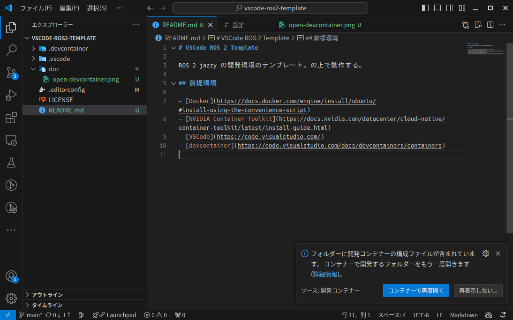

# VSCode ROS 2 Template

ROS 2 jazzy の開発環境のテンプレート。VSCodeのDevcontainer上で動作する。

NVIDIA Container Toolkitの設定を入れているため、NVIDIA Container Toolkitがない(つまり、NVIDIA GPUがない)環境では動作しない。

## 前提環境

- [Docker](https://docs.docker.com/engine/install/ubuntu/#install-using-the-convenience-script)
- [NVIDIA Container Toolkit](https://docs.nvidia.com/datacenter/cloud-native/container-toolkit/latest/install-guide.html)
- [VSCode](https://code.visualstudio.com/)
- [devcontainer](https://code.visualstudio.com/docs/devcontainers/containers)

## 起動方法

VSCodeでリポジトリを開くと「コンテナーで再度開く」と聞かれるので、それをクリックする。あるいは、コマンドパレット(`Ctrl+P`)で `Dev Containers: Reopen in Container` を実行する。

## インストールしているもの

- ベースイメージ : [osrf/ros:jazzy-desktop](https://hub.docker.com/r/osrf/ros/tags?page_size=&ordering=&name=jazzy-desktop-full)
- ツール
    - Cargo (ついでにRust)
        - [eza](https://github.com/eza-community/eza)
        - [fd-find](https://github.com/sharkdp/fd)
        - [ripgrep](https://github.com/BurntSushi/ripgrep)
        - [bat](https://github.com/sharkdp/bat)
    - `tmux`
    - [Taskfile](https://taskfile.dev/)
    - `fzf`
- エディタ設定
    - [EditorConfig](https://editorconfig.org/)
    - Pythonの補完用パス設定
